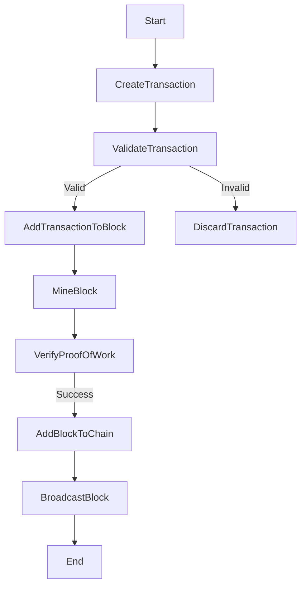
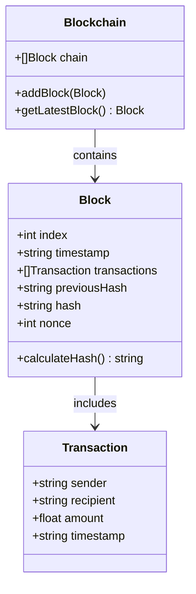
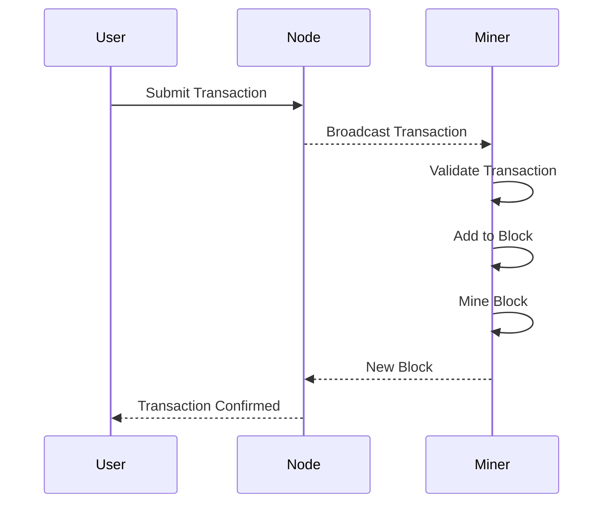

# Custom Blockchain Build

## Project Description

This project aims to create a custom blockchain tailored for metadata use cases. The focus is on building a flexible and modular architecture that allows for easy customization and integration with various network protocols. The blockchain will support efficient metadata storage, retrieval, and management, making it ideal for applications that require robust and fast metadata tracing proof.

## Features

- Customizable server container modules
- Configurable transport layer for diverse network protocols
- Efficient metadata storage and retrieval mechanisms
- Modular design for easy integration and scalability
- Comprehensive testing suite for transport and network connectivity
- ...(in progress)

## Process

- Create server container with customisable modules
- Configurable transport layer to allow any type of network protocol
- Create block builder 
- Create tranaction object to append to a block
- Create private/public key generator for sign and verification
- ...(in progress)

## Tests

```shell
make test
```

## Flows

### Flowchart of Adding a New Block


### Class Diagram of Blockchain Components


### Sequence Diagram of Transaction Processing
